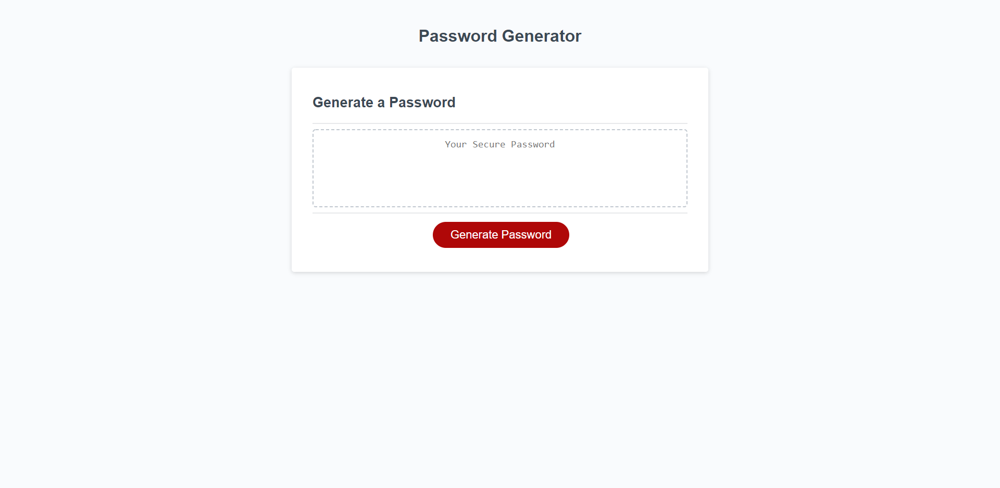

# JS-password

## The purose of this website is to auto geneerate a password for you randomly.

## Challenge Discripton

- make a password generate within 8-128 characters randomly

## Acceptance criteria

```
Given
```

## Tasks completed
The HTML document includes:
* A proper title and SEO metadata

## Languages 
- HTML
- CSS
- JavaScript

## Links
* [Deployed webpage](link)

* [Repo](https://github.com/davidg-07/JS-Password)

## Screenshot


## Credit
David Galvez

David.dmg17@gmail.com